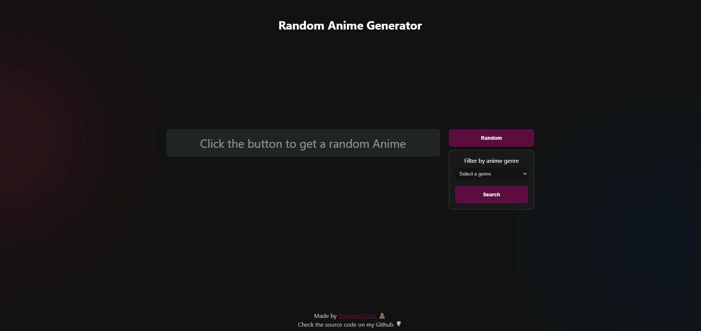

# Random Anime Generator
This is a Project where I'm practing API REST funcionality.

Have fun generating random animes (Maybe you could find your next favorite anime ╰(*°▽°*)╯).



## Setup 🛠️
Still working on it. If you're interested, you can clone this repo:

### Clone this repository:
```bash
git clone https://github.com/ManuelCh02/random-anime-generator.git
cd random-anime-generator
```

### Check the project
Once you've cloned this project, just open index.html file on your browser or utilize port forwarding or whatever you pro tech guys can do (PORT 3000 is my favorite btw ^_^)

## To-Do 🗒️
* Publish the project on the internet
* Make filters

## Contribuiting
Feel free to contribute. I will really appreciate every feedback you can give to me.

##
Thank you so much to Jikan (https://jikan.moe/) for providing this API.
