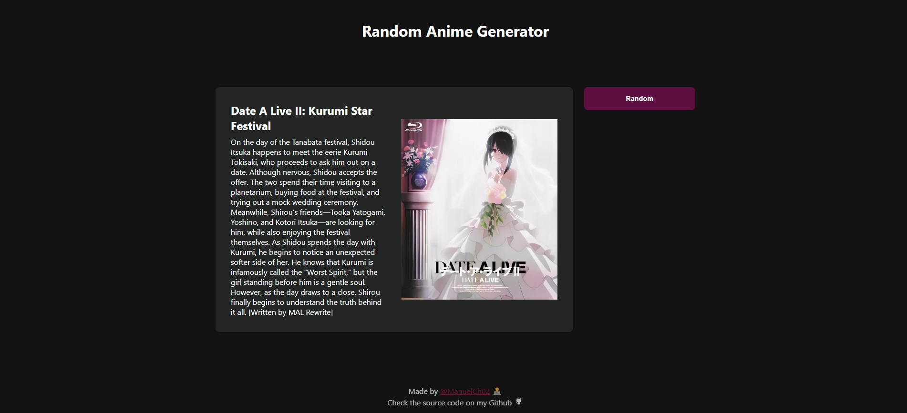

# Random Anime Generator
This is a Project where I'm doing some practice with API.

Have fun generating random animes (Maybe you could find your next favorite anime ╰(*°▽°*)╯).



## Setup 🛠️
This project is currently on beta. I'm working on being accesible for everyone. But if you're interested on it you can clone this and run on localHost:

### Clone this repository:
```bash
git clone https://github.com/ManuelCh02/random-anime-generator.git
cd random-anime-generator
```

### Check the project
You can do it by the route to index.html or open a PORT on your LOCALHOST (I like PORT 3000 btw ^_^)

## To-Do 🗒️
* Publish this on web
* Create filters

## Contribuiting
Feel free to contribute. I will really appreciate every feedback you can give to me.

##
Thank you so much Jikan (https://jikan.moe/) for providing this API
